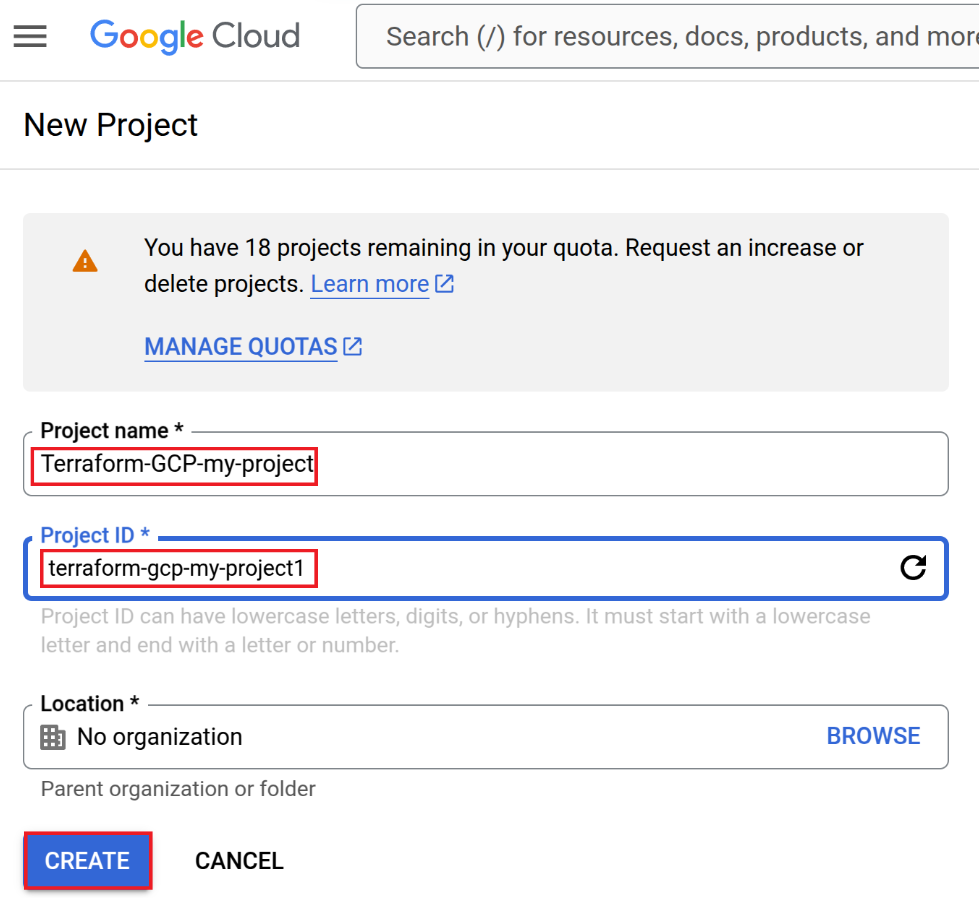
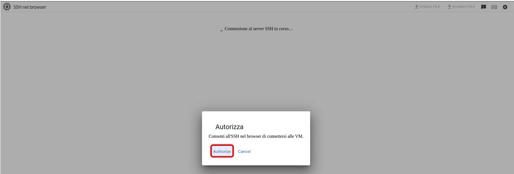
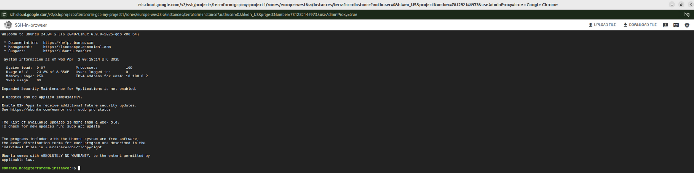

# Lab-terraform-GCP

## Quick Navigation
- [Prerequisites](#prerequisites)
- [Installation Guides](#installation-guides)
  - [Terraform Installation](#terraform-installation)
  - [gcloud CLI Installation](#gcloud-cli-installation)
- [Create VM Instance](#create-a-vm-instance-using-terraform)
- [Destroy VM Instance](#terraform-destroy)

---

This lab demonstrates how to deploy a virtual machine (VM) on [Google Cloud Platform (GCP)](https://cloud.google.com/) using [Terraform](https://www.terraform.io/). It includes steps for setting up prerequisites, configuring Terraform, and managing the VM lifecycle.

## Prerequisites

- **Google Cloud Platform Account**  
  - Sign up for a free tier account with [$300 in credits](https://cloud.google.com/free)  
  - Verify your payment method (no charges during trial)

- **Terraform 1.2.0+**  
  - [Installation guide](#terraform-installation) for Windows, macOS, and Linux (Ubuntu/Debian)

- **Google Cloud CLI (gcloud)**  
  - [Installation guide](#gcloud-cli-installation) for Windows, macOS, and Linux (Ubuntu/Debian)

---

## Installation Guides
[▲ Back to top](#lab-terraform-gcp)

### Terraform Installation
[▲ Back to top](#lab-terraform-gcp)

#### **Windows**
1. Download the binary file suitable for your system from: [HashiCorp](https://developer.hashicorp.com/terraform/install)
   - 386 for 32-bit systems
   - AMD64 for 64-bit systems
2. Extract the ZIP file to a directory
3. Add the directory to your system PATH:
   - Press Win + R, type sysdm.cpl > **Advanced** > **Environment Variables** > **System Variables** > Edit Path
4. To apply changes to the system disconnect from your Windows account or restart the system
5. Verify that Terraform has been correctly installed:
   ```bash
   terraform -v
   ```
  The output should look like:
  Terraform v1.11.0
  on windows_amd64


#### **MacOS**
1. Download the binary file suitable for your system from: [HashiCorp](https://developer.hashicorp.com/terraform/install)
2. Copy the download link: right-click on the "Download" button for the	appropriate system architecture:
   - 386 for 32-bit systems
   - AMD64 for 64-bit systems
3. 	Use curl to download the file. Open the Terminal and paste the following command (replace the URL with the one you copied):
   ```bash
    curl https://releases.hashicorp.com/terraform/1.11.0/terraform_1.11.0_darwin_arm64.zip -O
   ```
4. Find a directory in your $PATH. To check the directories in your $PATH, run:
   ```bash
   echo $PATH
   ```
5. Extract the archive. Use the unzip command to extract the .zip file into the chosen directory. Make sure to use the correct filename:
   ```bash
   sudo unzip terraform_1.11.0_darwin_arm64.zip -d /usr/local/bin
   ```
   This command will extract the terraform file into /usr/local/bin
6. Check the content of the directory. Verify that the terraform file was extracted correctly by running:
   ```bash
   ls -l /usr/local/bin
   ```
   You should see the terraform file listed
7. Verify the Terraform version. Run the following command to confirm that Terraform is installed correctly:
   ```bash
   terraform -version
   ```
   The output should look like:
   Terraform v1.11.0
   on darwin_ard64


#### **Linux (Debian/Ubuntu)**
1. Update the system: 
   ```bash
   sudo apt update && sudo apt upgrade -y
   ```
2. Download the binary file suitable for your system from: [HashiCorp](https://developer.hashicorp.com/terraform/install)
3. Use wget to download the file.  Open the terminal and use the following command, replacing the URL with the one you copied:
   ```bash
   wget https://releases.hashicorp.com/terraform/1.11.0/terraform_1.11.0_linux_amd64.zip
   ```
4. Check the directories in the $PATH.  Run the following command to see the directories included in your $PATH:
   ```bash
   echo $PATH	
   ```
5. Extract the folder  containing the Terraform executable to /usr/local/bin using the following command:
   ```bash
   sudo unzip terraform_1.11.0_linux_amd64.zip -d /usr/local/bin
   ```
6. Check the content of the directory. Verify that the Terraform file has been extracted correctly by running the following command:
   ```bash
   ls -l /usr/local/bin
   ```
7. Verify the installation by running the following command:
   ```bash
   terraform -version
   ```


### gcloud CLI Installation
[▲ Back to top](#lab-terraform-gcp)
Follow the [official guide for your OS](https://cloud.google.com/sdk/docs/install)

#### **Windows**
1. Visit the official Google Cloud CLI download page to download the [installer](https://dl.google.com/dl/cloudsdk/channels/rapid/GoogleCloudSDKInstaller.exe)
2. Once you have downloaded the installer, you can double click on it to open it, then click follow the guided installation leaving everything as set by default
3. Once the Google Cloud CLI setup is completed, the command gcloud init will be runned automatically (see previous slide) You must sign in to continue, when prompted press Y
4. Follow the instructions in the browser to complete the setup, enter you email to sign in and press “Next”, then click "Continue" to sign in to Google Cloud SDK and click "Allow". Now you have been authenticated with the gcloud CLI
5. From Google Cloud CLI it will be asked if you want to create a new project, press Y to create it and then you will be asked to enter a project ID. Once created, your current project will be set to the project you have just created

#### **MacOS**
1. **Ensure that your system has a supported Python version (Python 3.8 to 3.13).** You can check your Python version by running one of the following commands in the terminal:
   ```bash
   python3 -V
   ```
   or
   ```bash
   python -V
   ```
   If you don't have a supported version of Python, you can download it from python.org
   If you have multiple Python installations, set the CLOUDSDK_PYTHON environment variable to point to the correct version
2. **Download the Google Cloud CLI Archive.** [Select the correct package based on your system architecture](https://cloud.google.com/sdk/docs/install#mac)
   To determine your system architecture, run:
   ```bash
   uname -m
   ```
   
3. **Extract the archive.** After downloading the .tar.gz archive, extract it to any location on your system (preferably your Home directory)
   You can do this by opening the .tar.gz file and extracting it in finder, or use the terminal:
   ```bash
   tar -xvzf google-cloud-cli-darwin-x86_64.tar.gz
   ```
4. **Replace Existing Installation (if applicable).** If you already have a Google Cloud SDK installation, remove the existing google-cloud-sdk directory, then extract the new archive to the same location

5. **Run the Installation Script.** Navigate to the extracted directory and run the installation script:
   ```bash
   cd google-cloud-sdk
	 ./google-cloud-sdk/install.sh
   ```
   The script will prompt you to install Python 3.12 (if not already installed) and certain recommended modules
   You can run the script non-interactively with custom flags. To see the available flags, run:
   ```bash
   ./google-cloud-sdk/install.sh --help
   ```
6. During the installation, you will be prompted to:
   - Install Python 3.12 and certain modules
   - Add Google Cloud CLI to your PATH and enable command completion
   - Send anonymous usage statistics to Google (optional)
   - Answer Y when prompted to confirm the installation settings
   If you updated your PATH in the previous step, open a new terminal for the changes to take effect

7. After installation, initialize the gcloud CLI by running:
   ```bash
   ./google-cloud-sdk/bin/gcloud init
   ```
   This will guide you through the setup process (e.g., logging into your Google account, setting the default project, similar process as shown for Windows)

#### **Ubuntu/Debian**
1. Ensure your system is up to date:
   ```bash
   sudo apt-get update
   ```
2. Install required dependencies:
   ```bash
   sudo apt-get install apt-transport-https ca-certificates gnupg curl
   ```
3. Import the Google Cloud Public Key, for newer distributions (Debian 9+ or Ubuntu 18.04+):
   ```bash
   curl https://packages.cloud.google.com/apt/doc/apt-key.gpg | sudo gpg --dearmor -o /usr/share/keyrings/cloud.google.gpg
   ```
4. If your distribution's apt-key command doesn't support the --keyring argument, run the following command:
   ```bash
   curl https://packages.cloud.google.com/apt/doc/apt-key.gpg | sudo apt-key add -
   ```
5. Add the Google Cloud SDK Repository, for newer distributions (Debian 9+ o	Ubuntu 18.04+):
   ```bash
   echo "deb [signed-by=/usr/share/keyrings/cloud.google.gpg] https://packages.cloud.google.com/apt cloud-sdk main" | sudo tee -a /etc/apt/sources.list.d/google-cloud-sdk.list
   ```
6. Install the gcloud CLI:
   ```bash
   sudo apt-get update && sudo apt-get install google-cloud-cli
   ```
   Press Y when prompted
7. Run gcloud init to get started:
   ```bash
   gcloud init
   ```
   Press Y to sign in. Your browser should open automatically to visit the URL. If it doesn’t, copy and open the link manually
   Follow the instructions in the browser to complete the setup, enter you email to sign in and press “Next”, then click "Continue" to sign in to Google Cloud SDK and click "Allow". Now you have been authenticated with the gcloud CLI
   From Google Cloud CLI it will be asked if you want to create a new project, press Y to create it and then you will be asked to enter a project ID. Once created, your current project will be set to the project you have just created

---

# Create a VM instance using Terraform
[▲ Back to top](#lab-terraform-gcp)

## Setup Environment
Once you have been authenticated with the gcloud CLI, enter the Google Cloud Platform and enter in the project you have previously created
In case you have not create a project yet, you can create it from the Console as shown in the figures below




Then select the project you have just created


You are now working in the project: “Terraform-GCP-my-project”


From your **host terminal**, if you have not logged in already:
```bash
gcloud auth application-default login
```
If you created your project using the GCP GUI, run the following command to switch projects:
```bash
gcloud auth application-default login PROJECT_ID
```
*Note. The Project ID is highlighted in red in the figure and does not correspond to the project name*

## Enable Compute Engine
Terraform requires this API to manage Compute Engine resources
Go to "APIs & Services" in the Google Cloud Console and select “API and enabled services”
If the API is already enabled, the page will show "Manage" instead of "Enable"


Click on “Enable API and services”


Search “Compute engine”


Click on “Compute Engine API”


Click on “Enable”


Verify that the state is now active


## Create main.tf file
Open your terminal, if you are using Windows open PowerShell

Create a directory, for example, gcp-terraform:
```bash
mkdir gcp-terraform
```
Enter the directory:
```bash
cd gcp-terraform
```
Create the main.tf file:
On Unix-based systems (Linux/macOS), you can use:
```bash
nano main.tf
```
On Windows, you can use an IDE. For example, if you have Visual Studio Code installed (and the environment variable is correctly set), run:
```bash
code main.tf
```

### File main.tf: Provider Configuration
```bash
provider "google" {
  project     = "terraform-gcp-my-project1"
  region      = "europe-west8"
}
```
- Specifies the Google Cloud provider for Terraform
- **project = "terraform-gcp-my-project1"** → Defines the GCP project ID
- **region = "europe-west8"** → Sets the default region (Milan, Italy). Although the provider defines the region, the VM zone is explicitly set in the resource block

### File main.tf: Compute Engine VM Instance
```bash
resource "google_compute_instance" "vm_instance" {
  name         = "terraform-instance"
  machine_type = "e2-micro"
  zone         = "europe-west8-a"
```

- Creates a Compute Engine VM instance named "terraform-instance"
- **machine_type = "e2-micro"** → Defines a small, cost-effective machine type
- **zone = "europe-west8-a"** → Specifies the exact zone in the Milan region

### File main.tf: Boot Disk Configuration
```bash
  boot_disk {
    initialize_params {
      image = "ubuntu-os-cloud/ubuntu-2404-lts-amd64"
    }
  }
```
- Defines the boot disk of the instance
- **image = "ubuntu-os-cloud/ubuntu-2404-lts-amd64"** → Uses Ubuntu 24.04 LTS as the operating system
- The disk is automatically created and attached when the instance is provisioned

### File main.tf: Network Configuration
```bash
  network_interface {
    network = "default"
    access_config {}
  }
}
```
- Attaches the VM to the default VPC (Virtual Private Cloud)
- **access_config {}** → Allocates a public IP address for external access

### File main.tf: Output Public IP
```bash
output "vm_ip" {
  description = "The public IP address of the VM instance"
  value       = google_compute_instance.vm_instance.network_interface[0].access_config[0].nat_ip
}
```

## Complete main.tf file
```bash
provider "google" {
  project     = "terraform-gcp-my-project1"
  region      = "europe-west8"
}

resource "google_compute_instance" "vm_instance" {
  name         = "terraform-instance"
  machine_type = "e2-micro"
  zone         = "europe-west8-a"

  boot_disk {
    initialize_params {
      image = "ubuntu-os-cloud/ubuntu-2404-lts-amd64"
    }
  }

  network_interface {
    network = "default"
    access_config {}
  }
}

output "vm_ip" {
  description = "The public IP address of the VM instance"
  value       = google_compute_instance.vm_instance.network_interface[0].access_config[0].nat_ip
}
```

Close and save you main.tf file

## Terraform init
Save your main.tf file and, from your terminal, run:
```bash
terraform init
```


## Terraform apply
Then, run the command:
```bash
terraform apply
```
Enter yes when prompted, and the VM will be created, in output you will see the public IP of the VM


## Access the VM
Go to "Compute Engine" in the Google Cloud Console and select “VM instances”


The VM has been successfully created. You can verify that the external IP matches
Now click on SSH to connect


Authorize SSH in the browser to connect to the VM



Now you are successfully connected to the VM via SSH




## Terraform destroy
[▲ Back to top](#lab-terraform-gcp)
Once you have finished using the VM, you can easily destroy it by running the following command from your terminal:
```bash
terraform destroy
```
Enter yes when prompted and in about a minute, your VM will be properly destroyed
*Note. In Cloud environments, it is important to deallocate your instances to avoid incurring unexpected costs*


